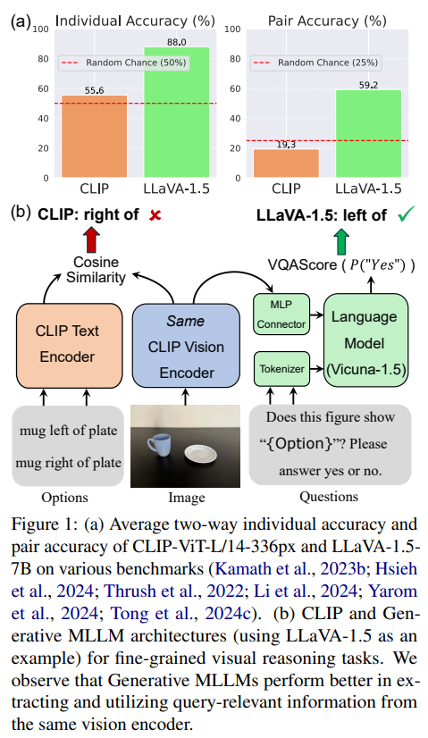
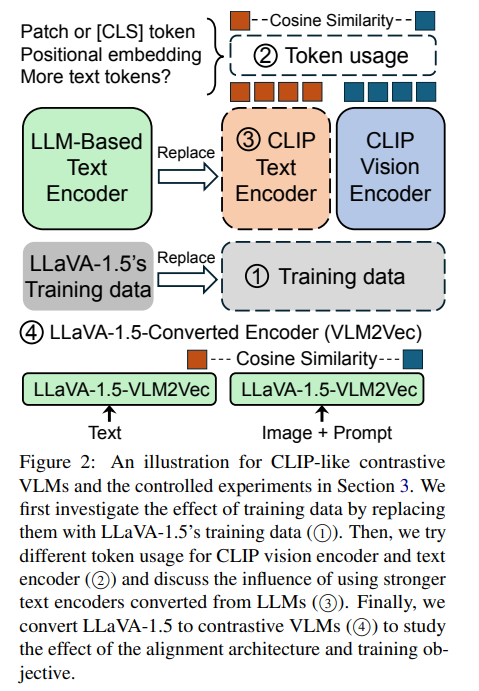

# Exploring How Generative MLLMs Perceive More Than CLIP with the Same Vision Encoder (ACL 2025)

This repo includes the code for "Exploring How Generative MLLMs Perceive More Than CLIP with the Same Vision Encoder" (ACL 2025). 
<p align="center">
    
    
</p>

## Evaluation on What'sUp and MMVP/MMVP-VLM

First, download the [What'sUp dataset](https://github.com/amitakamath/whatsup_vlms) and [MMVP/MMVP-VLM](https://github.com/tsb0601/MMVP) accordingly. Our evaluation code is also based on their code.

For CLIP-ViT-L/14-336px: Check `Patch-Aligned-Contrastive-Learning/eval_clip.py` and the scripts in `Patch-Aligned-Contrastive-Learning/eval.sh`.

For LLaVA-1.5-7B, Phi-3-V-3.8B, LLaMA-3-V-8B: Check `Patch-Aligned-Contrastive-Learning/eval_vqa_score.py` and the scripts in `Patch-Aligned-Contrastive-Learning/eval.sh`.

For original LLM2CLIP: Use `open_clip/src/eval_llm2clip.sh`.

The additional questions for converted MMVP/MMVP-VLM are attached in `additional_questions`. Please place them in your folder containing MMVP and MMVP-VLM data, respectively.

## Evaluation on Other Benchmarks

The code is based on [t2v_metrics](https://github.com/linzhiqiu/t2v_metrics). We add new datasets and new models for our experiments. Please follow their instruction on environment installation, and then use `t2v_metrics/eval.sh`.

## Ablation on Training Data

We use the [OpenCLIP](https://github.com/mlfoundations/open_clip) to finetune the pretrained CLIP, SigLIP, and EVA-CLIP model on converted LLaVA-1.5's data. Please download the data following [LLaVA-1.5's instruction](https://github.com/haotian-liu/LLaVA), install the environment required by [OpenCLIP](https://github.com/mlfoundations/open_clip), and then check our `open_clip` folder for (1) dataset setting and (2) NegCLIP-style loss for training with left/right negatives. You can use `train-clip.sh` for finetuning CLIP as an example. Remove the `--lock-image ` option if you want to try finetuning with the unfrozen vision encoder.

## Ablation on Token Usage on LLaVA-1.5

For the ablation on LLaVA-1.5, we only added one thing based on the [official code](https://github.com/haotian-liu/LLaVA): the `'cls'` option, in their `llava/model/multimodal_encoder/clip_encoder.py`, corresponding scripts, and parameters:

```
def feature_select(self, image_forward_outs):
    image_features = image_forward_outs.hidden_states[self.select_layer]
    if self.select_feature == 'patch':
        image_features = image_features[:, 1:]
    elif self.select_feature == 'cls_patch':
        image_features = image_features
    elif self.select_feature == 'cls':     # Here
        image_features = image_features[:, 0:1]
    else:
        raise ValueError(f'Unexpected select feature: {self.select_feature}')
    return image_features
```

Then we train the model with the `'cls'` option for both stages (Pre-training for Feature Alignment + Fine-tuning End-to-End). The checkpoints can be downloaded at https://huggingface.co/lst627/llava-v1.5-7b-lora-merged and https://huggingface.co/lst627/llava-v1.5-7b-lora-cls-merged.

## Ablation on Token Usage and Language Model on CLIP

For PACL (with patch tokens for image) and SPARC (with patch tokens for image and multiple text tokens), our code is based on an implementation of [PACL](https://github.com/NMS05/Patch-Aligned-Contrastive-Learning). Check `Patch-Aligned-Contrastive-Learning` for all the relevant code. For replacing the text encoder with a stronger LLM-based text encoder, we first calculate all the text embeddings to accelerate training. The embeddings can be downloaded [here]().

## Ablation on Alignment Architecture and Prompt

Our code is based on a previous commit of [VLM2Vec] (https://github.com/TIGER-AI-Lab/VLM2Vec). Please refer to their repository for setting up the environment.

Our LLaVA-1.5-7B-VLM2Vec-LoRA checkpoint can be downloaded [here](https://huggingface.co/lst627/LLaVA-1.5-7B-VLM2Vec-LoRA) and can be evaluated using `VLM2Vec/eval.sh`. If you would like to reproduce the training process, please refer to `VLM2Vec/scripts/llava_1.5/run_train.sh`. 

## Citation

If you find our code, data, or the paper useful, please cite the paper:

```
@article{li2024erroneous,
  title={On Erroneous Agreements of CLIP Image Embeddings},
  author={Li, Siting and Koh, Pang Wei and Du, Simon Shaolei},
  journal={arXiv preprint arXiv:2411.05195},
  year={2024}
}
```